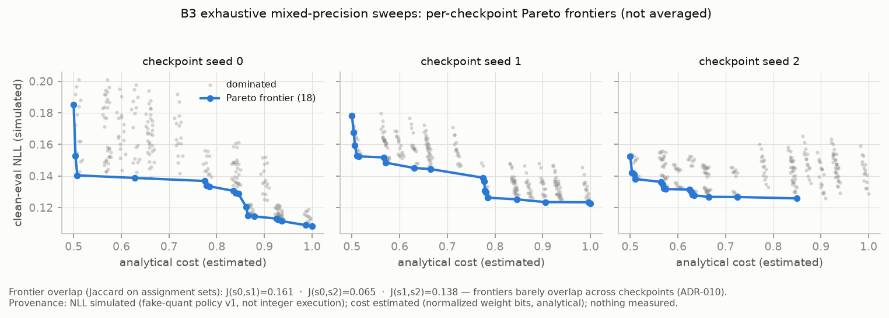
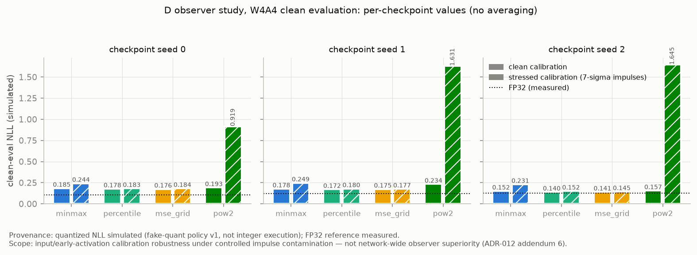
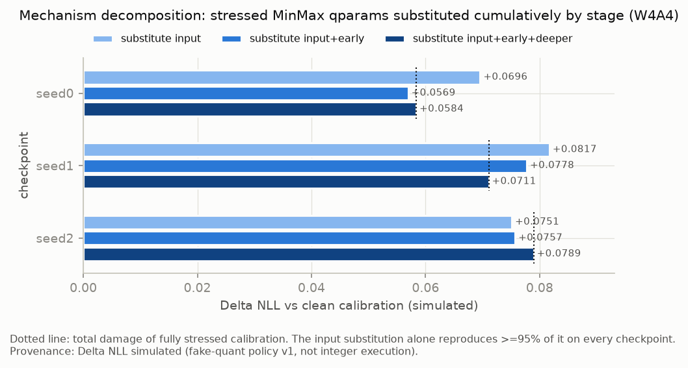
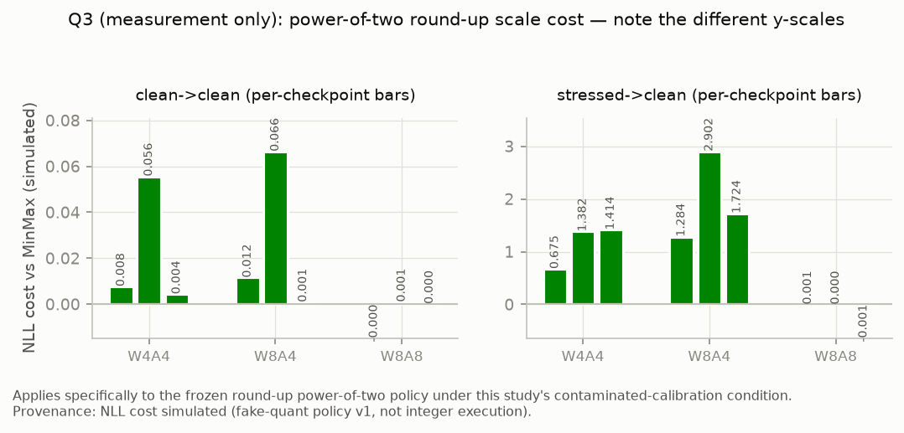

# QuantScope findings report

An honest summary of what the QuantScope experiments found — including
the negative results and failed gates, which get the same prominence
as the positives. The generated run artifacts are the numerical source
of truth; the ADRs in `docs/DECISIONS.md` supply interpretation and
experiment history, not replacement numbers. Figures are regenerated
deterministically from artifacts by `scripts/build_report.py`; their
sources and hashes are recorded in
[`report/figures/manifest.json`](report/figures/manifest.json).

## Provenance legend (applies to every number and figure)

| Label | Meaning |
| --- | --- |
| **measured** | actually executed and observed: FP32 evaluation; real INT8 backend task outputs in step C |
| **simulated** | fake-quant simulation policy v1 (FP32 arithmetic, fake-quantized weights/activations) — *not* integer execution |
| **estimated** | analytical cost model (normalized weight bits) — *not* a measurement |

No latency was measured anywhere in these experiments, and nothing in
this report is NPU or hardware performance. The hardware profile in
this repository is fictional and illustrative.

## Related work (positioning, not novelty claims)

QuantScope reimplements standard quantization components at teaching
scale and tests them under preregistered protocols; none of the
individual mechanisms is novel. Affine quantization, QAT with fake
quantization, and integer-arithmetic inference follow Jacob et al.
(CVPR 2018) and the surveys of Gholami et al. (2021) and Nagel et al.
(2021). The straight-through estimator is Bengio et al. (2013); our
*fixed-quantization-specification* QAT is a deliberately simpler
cousin of learned-scale methods such as PACT (Choi et al., 2018) and
LSQ (Esser et al., ICLR 2020) — scales are derived, not learned,
which isolates weight adaptation as the only mechanism. Calibration
clipping against outliers is established practice: percentile/entropy
calibration (Migacz, TensorRT 2017), analytical clipping in ACIQ
(Banner et al., NeurIPS 2019), rounding-aware methods like AdaRound
(Nagel et al., ICML 2020); activation-outlier sensitivity at low bit
widths is also central to SmoothQuant (Xiao et al., 2022). Our
contribution there is not the observers but the *paired,
gate-controlled contamination protocol* and the mechanism
decomposition. Sensitivity-guided mixed-precision search follows
HAWQ (Dong et al., ICCV 2019) and HAQ (Wang et al., CVPR 2019); our
negative finding — one-at-a-time ablation rankings failing to guide
joint assignment on this benchmark — is consistent with the known
limitation that per-layer sensitivity ignores interaction effects,
and is offered as a documented small-scale data point, not a
refutation of those methods.

## Benchmark context

All findings are on the Texture-10 synthetic benchmark (frozen
`freq_step=0.12` recipe, ADR-008/009) with the 8-group
BottleneckResNet under simulation policy v1, three independently
trained validation checkpoints (seeds 0/1/2). **No claim below
generalizes beyond this benchmark, model scale, and configuration.**

## B3 — exhaustive mixed-precision search analysis (negative finding)

Exhaustive 256-configuration sweeps per checkpoint, with every search
strategy scored against the exact optimum (ADR-010 + addendum).



*Fields: NLL simulated; cost estimated. One panel per checkpoint — the
three frontiers are deliberately not averaged, because they barely
overlap (Jaccard on assignment sets 0.161 / 0.065 / 0.138).*

- Mixed-precision tradeoffs are real: budget-feasible NLL spreads
  0.029–0.062 per checkpoint, frontiers of 15–18 points, 14–16 of them
  mixed-precision (simulated/estimated).
- **One-at-a-time ablation rankings failed to guide joint assignment
  on this benchmark.** The sensitivity-ranked path had budget regret
  0.0465 / 0.0338 / 0.0036 across seeds; random search with 32
  evaluations had median regret 0.0035 / 0.0018 / 0.0011 — better on
  every seed. Greedy joint-effect search worked (regret 0.0095 /
  0.0025 / 0.0009 in 21 / 6 / 6 evaluations). This does **not** prove
  that sensitivity methods generally fail; it shows the one-shot
  ablation effects measured here do not compose additively into joint
  quality at this scale, where interaction effects dominate. (Caveat
  recorded in ADR-010: 32 random samples cover 12.5% of this small
  space; random search would not scale this way.)
- Neither rankings nor Pareto sets transferred across training runs:
  transfer penalties ranged +0.0222 to −0.0411, and one foreign
  ranking beat a native one — consistent with noise-dominated
  rankings.

### Follow-up: analytical hardware cost model (ADR-014)

The Pareto figure above uses B3's historical *weight-bits proxy* cost,
preserved as recorded. ADR-014 later replaced the proxy with a
profile-driven analytical model (fictional `generic_edge_npu` profile,
schema v1; all coefficients are assumptions and every cost is
**estimated** for the modeled quantizable workload only — no latency,
energy, or throughput was measured). Re-scoring the same frozen 256
configurations per checkpoint: rank correlation with the proxy is
Spearman ρ = 0.886 (identical across checkpoints — cost depends only
on the assignment); Pareto-frontier membership shifts with Jaccard
0.609 / 0.462 / 0.300 (seeds 0/1/2); and budget recommendations at
normalized costs 0.60/0.75/0.90 changed in 7 of 9 checkpoint×budget
cells. Mechanism example: configurations tied under the weight-bits
proxy separate once activation traffic counts — quantizing the stem
(few weights, large early activation maps) is nearly free to the
proxy but materially cheaper under the profile. Artifacts:
`runs/validation-012/texture-a-seed{0,1,2}-hwcost/`,
`runs/validation-012/hwcost-study-summary.json` (component-wise
costs, lineage hashes, and recommendations; provenance labeled).

## C — backend parity (validation, with two compatibility findings)

C validates **QuantScope's Torch-2.2-compatible arithmetic and backend
comparison for this graph and configuration** — a graph-anchored
simulator holding Torch's fusion, placement, and calibration constant
while swapping in QuantScope's affine arithmetic (ADR-011 + addendum).

| Checkpoint | sim (simulated) | reference FX (simulated) | real INT8 (measured) |
| --- | --- | --- | --- |
| seed 0 | acc 0.9575 | acc 0.9580 | acc 0.9580, NLL 0.1088 |
| seed 1 | acc 0.9525 | acc 0.9530 | acc 0.9530, NLL 0.1234 |
| seed 2 | acc 0.9525 | acc 0.9515 | acc 0.9515, NLL 0.1298 |

- Quantization parameters exact under the `torch_2_2` policy;
  reference↔real-INT8 prediction disagreement 0.0000 on every seed;
  sim↔reference residuals fully localized to float32-vs-float64
  rounding-tie resolution (≤0.5% prediction disagreement).
- Two named compatibility findings, not bugs swept under the rug:
  Torch 2.2.2's symmetric scale uses a 127.5 denominator vs
  QuantScope's 127 (~0.39% systematic difference, both calculations in
  the artifact), and division-precision tie resolution is systematic
  at requantization nodes.
- Only the real-INT8 task outputs above are measured; C measured no
  latency.

## D — observer-policy study (narrow positive, after two failed gates)

### Stress-design gate history (all preregistered; none reinterpreted)

| Gate | Design | Result |
| --- | --- | --- |
| v1 (dev seed 7, 6σ and 10σ) | ≥25% MinMax expansion at ≥5/9 sites | **FAILED** — 4/9 at both magnitudes. The assumption that pixel impulses expand ranges network-wide was falsified: convolution and downsampling attenuate them past the first block. Behavioral damage passed at both magnitudes. |
| v2 (fresh dev seed 8, 6σ, structural early-site criteria) | ≥3/4 early sites ≥1.25×, input ≥2×, NLL damage >0.02 | **FAILED** — input expansion 1.96× vs 2.0×, an arithmetic ceiling (6σ impulses / ~3.06σ clean extremes). Recorded as failed; no threshold adjusted. |
| v3 (fresh dev seed 6, sole change 6σ→7σ, thresholds retained) | identical to v2 | **PASSED** — input 2.43×, early reach 4/4, behavioral +0.1925 NLL, pairing intact. Single attempt, no fallback. |

### Primary result (Q1) — confirmed, and deliberately narrow



*Fields: quantized NLL simulated; FP32 reference measured. Bars are
per-checkpoint values; no means.*

> Percentile and MSE-grid observers improve robustness to controlled
> input-calibration impulse contamination at four-bit activation
> precision. The mechanism decomposition localizes at least 95% of
> the MinMax damage to the input observer, so the result does not
> establish network-wide observer superiority.

In the primary condition (stressed calibration → clean evaluation,
W4A4): percentile improves mean NLL over MinMax by 0.0698 (per seed
0.0610 / 0.0692 / 0.0791) and MSE-grid by 0.0728 (0.0601 / 0.0723 /
0.0861), favorable on 3/3 seeds, accuracy better by ~3.2 pp — all
simulated. The benefit is not clipping-driven: on clean probe data the
robust observers clip ≤0.10% of input values while recovering
input SQNR from 7.4–8.0 dB (MinMax) to 14.8–16.9 dB.



*Field: ΔNLL simulated. Substituting only the stressed input-observer
qparams reproduces ≥95% of the full damage on every checkpoint —
this is input/early-activation calibration robustness, demonstrated
under controlled impulse contamination, not network-wide observer
superiority.*

### Q2 — clean-data non-inferiority: holds in all six cells

Mean NLL worse-than-MinMax on clean data (tolerance 0.005, per
configuration, never pooled; negative = better; simulated):
percentile −0.0084 / −0.0069 / +0.0005 and MSE-grid −0.0081 / −0.0076
/ +0.0005 for W4A4 / W8A4 / W8A8. At W8A8, observer choice is
behaviorally negligible (≤0.0008 NLL on every seed).

### Q3 — power-of-two cost (measurement only)



*Field: NLL cost simulated. Panels intentionally use different
y-scales.*

**This result applies specifically to the frozen round-up
power-of-two policy under this study's contaminated-calibration
condition.** There, its cost is the largest effect in the study:
+0.67 to +2.9 NLL at 4-bit activations (round-up doubles
already-inflated MinMax ranges). On clean calibration the cost is
modest (0.004–0.066 NLL at A4) and negligible at W8A8. The
power-of-two scale property was verified exact in every arm.

### Ranking stability (reported, not gated)

Percentile and MSE-grid swap first/second across checkpoints (their
NLLs differ by <0.01); the MinMax→pow2 tail is stable on all three.
Pairwise Spearman 0.8 / 0.8 / 1.0. Consistent with B's lesson:
fine-grained rankings are seed-sensitive; the robust-vs-baseline
separation here is not.

### Evidence caveats

1. **ReLU-site saturation rates are not a clipping measure**: post-ReLU
   zeros sit on the `qmin` code, dominating those rates (~0.61–0.70
   for every observer). Clipping interpretation is restricted to the
   input site; scale, SQNR, and task metrics remain valid at all
   sites.
2. **Every W4A4/W8A4/W8A8 number in D is simulated** (fake-quant
   policy v1), not measured integer execution.

## QAT — fixed-specification fine-tuning recovers most PTQ damage
(ADR-013 + ADR-016 control)

Fixed-quantization-specification W4A4 QAT (frozen activation qparams;
weight scales re-derived per forward under the frozen rule; clipped
STE; 10 epochs at lr 3e-4, epoch-10 checkpoint, no warm-up) was
preregistered, recipe-selected on a fresh dev seed, and run once per
validation checkpoint. All W4A4 values simulated; FP32 measured;
bootstrap 95% CIs (n=2000 paired samples, B=10,000) in brackets.

| seed | PTQ → QAT NLL | ΔNLL [95% CI] | acc recovery | gap recovery |
| --- | --- | --- | --- | --- |
| 0 | 0.1853 → 0.1122 | −0.0731 [−0.0905, −0.0567] | +2.70 pp | 0.940 |
| 1 | 0.1782 → 0.1328 | −0.0454 [−0.0625, −0.0279] | +1.55 pp | 0.828 |
| 2 | 0.1525 → 0.1400 | −0.0125 [−0.0227, −0.0024] | +0.55 pp | 0.518 |

**The confound control (ADR-016):** an identical fine-tune with no
fake quantization (same seeds, batch order, optimizer, schedule),
followed by standard PTQ, does NOT reproduce the gain — control-PTQ
landed *worse* than the original PTQ on every checkpoint (+0.0302 /
+0.0201 / +0.0129 NLL, all CIs excluding zero), and QAT beat the
control by −0.1033 / −0.0655 / −0.0254 (all CIs exclude zero). The
gain is therefore attributable to training *through* the quantizer,
not to extra training. Every interval above excludes zero, including
the smallest effect (seed 2). Effect size tracks the PTQ gap; no
checkpoint reached FP32 quality (not required by the ADR).

## External replication (ADR-016): the observer finding survives real
data

The D-study primary finding — percentile calibration protects W4A4
NLL against impulse-contaminated calibration relative to MinMax —
was replicated as a *direction-only* claim on FashionMNIST (the
project's only dataset download; 12k-sample training subset, 2 seeds,
TinyCNN, FP32 85.1/85.2% measured). It replicated on 2/2 seeds with
larger effects than the synthetic benchmark: stressed→clean W4A4 NLL
0.8232 (MinMax) vs 0.5324 (percentile) on seed 0, and 2.3105 vs
0.8560 on seed 1 (simulated). Magnitudes are reported, not claimed.
The synthetic-benchmark bootstrap CIs for the same contrast also all
exclude zero (upper bounds ≤ −0.041 NLL).

## Cost-model sensitivity (ADR-016): the load-bearing assumption

One-at-a-time ±50% sweeps over all six profile coefficients show the
ADR-014 recommendations are driven almost entirely by the
W4A4-vs-W8A8 compute-cost ratio (3–9 of 9 checkpoint×budget
recommendations change) and are completely insensitive to both
memory coefficients and the unused precision pairs (0 of 9 change).
Anyone adapting the profile to real hardware should calibrate that
compute ratio first; the memory terms barely matter under this
profile shape. All estimated; the profile remains fictional.

## Reproducing the figures

```bash
python scripts/build_report.py \
  --validation-dir runs/validation-012 \
  --summary runs/validation-012/observer-study-summary.json \
  --out docs/report/figures
```

The build reads artifacts without modifying them, fails loudly on
missing artifacts or fields, performs no retraining/recalibration/
recomputation, and writes byte-deterministic PNGs plus
`manifest.json` (source paths, SHA-256 hashes, field-level provenance
labels).

## Deferred (optional appendix list)

- **Q4** (sim_custom ↔ backend-matched at W8A8): explicitly
  non-gating; C already validated backend-matched W8A8; D shows
  observer differences at W8A8 are ≤ ~0.001 NLL — little marginal
  value now.
- **W3A3 stress test**: deferred since ADR-012.
